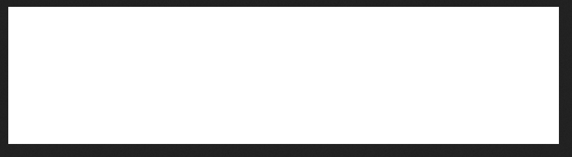

# 2 - Create Basic Image

1. Generate Home Controller

```
php artisan make:controller HomeController
```

2. open `HomeController.php`

```
<?php

namespace App\Http\Controllers;

use Illuminate\Http\Request;
use Symfony\Component\HttpFoundation\Response;

class HomeController extends Controller
{    
    public function index()
    {
        // Create a blank image with white background
        $image = imagecreatetruecolor(800, 200);
        
        // Allocate a color for the image (white)
        $white = imagecolorallocate($image, 255, 255, 255);
        
        // Fill the image with white color
        imagefilledrectangle($image, 0, 0, 800, 200, $white);
        
        // Start output buffering to capture the image data
        ob_start();
        
        // Output the image as PNG
        imagepng($image);
        
        // Get the image data from the buffer
        $imageBlob = ob_get_clean();
        
        // Free up memory
        imagedestroy($image);
        
        // Create a response with the image blob
        return response($imageBlob, 200)->header('Content-Type', 'image/png');
    }
}
```

3. open `web.php`

```
<?php

use Illuminate\Support\Facades\Route;

Route::get('/', function () {
    return view('welcome');
});


use App\Http\Controllers\HomeController;

Route::get('/', [HomeController::class,'index']);
```

