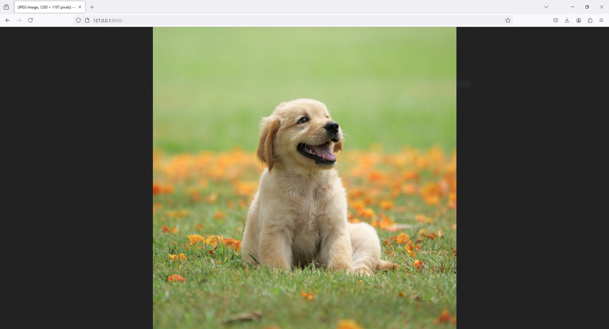

# 5 - Read Image

1. open `HomeController.php`

```
<?php

namespace App\Http\Controllers;

use Illuminate\Http\Request;
use Symfony\Component\HttpFoundation\Response;

class HomeController extends Controller
{    

    public function index()
    {
        $imagePath = public_path('dog.jpg');
        
        // Create an image resource from the given image path
        $image = imagecreatefromjpeg($imagePath);
        
        // Set the content type header
        header("Content-Type: image/jpeg");
        
        // Output the image
        imagejpeg($image);
        
        // Free up memory
        imagedestroy($image);
    }
}
```

2. open `HomeController.php`

```
<?php

namespace App\Http\Controllers;

use Illuminate\Http\Request;
use Symfony\Component\HttpFoundation\Response;

class HomeController extends Controller
{    

    public function index()
    {
        $imagePath = public_path('dog.jpg');
        
        // Create an image resource from the given image path
        $image = imagecreatefromjpeg($imagePath);
        
        // Start output buffering to capture the image data
        ob_start();
        
        // Output the image as PNG
        imagepng($image);
        
        // Get the image data from the buffer
        $imageBlob = ob_get_clean();
        
        // Free up memory
        imagedestroy($image);
        
        // Create a response with the image blob
        return response($imageBlob, 200)->header('Content-Type', 'image/png');
    }
}
```
