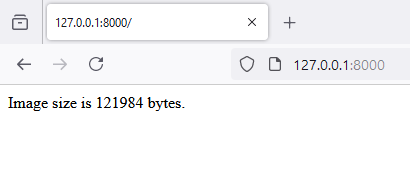

# 6 - Get Image Size
 
1. open `HomeController.php`

```
<?php

namespace App\Http\Controllers;

use Illuminate\Http\Request;
use Symfony\Component\HttpFoundation\Response;

class HomeController extends Controller
{    

    public function index2()
    {
        $imagePath = public_path('dog.jpg');
        
        // Create an image resource from the given image path
        $image = imagecreatefromjpeg($imagePath);
        
        // Get the image size in bytes
        $size = filesize($imagePath);
        
        echo 'Image size is ' . $size . ' bytes.';
        
        // Free up memory
        imagedestroy($image);
    }
}
```

